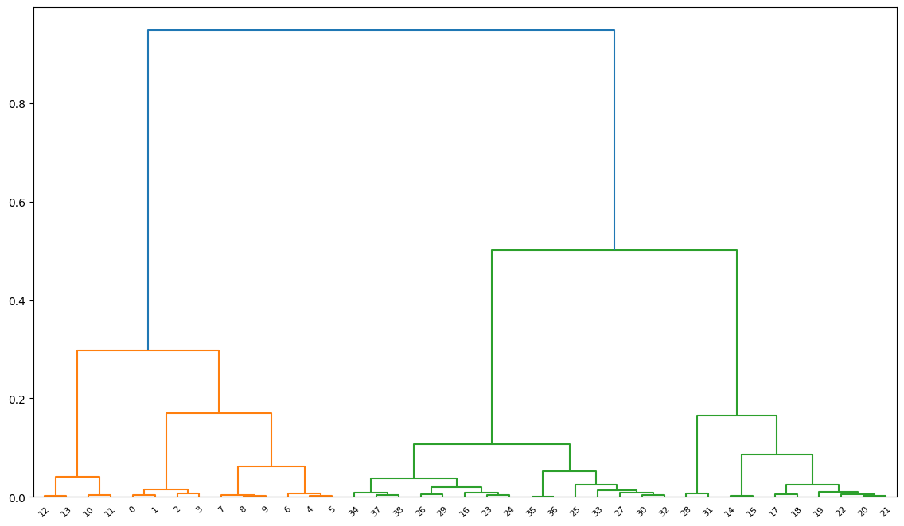
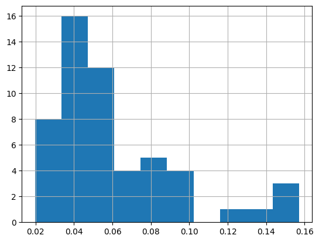

# EVCI Siting Tool

<!-- WARNING: THIS FILE WAS AUTOGENERATED! DO NOT EDIT! -->

## Install

Use github to access the repository, clone it on your local machine

`git clone git@github.com:mpensystems/evci_freight_v2.git` or

`git clone https://github.com/mpensystems/evci_freight_v2.git`

## How to use

The model inputs are provided in the form of excel files (xlsx). The
`analyze_sites()` is the entry level function and completes the analysis
for specified corridor

``` python
from evci_tool.config import *
from evci_tool.model import *
from evci_tool.analysis import *

# Inputs from UI
ui_inputs = { 
    "backoff_factor": 1,
    "M": ["3WS", "4WS", "4WF"],
    "years_of_analysis": [1,2,3],
    "capex_2W": 2500,
    "capex_3WS": 112000,
    "capex_4WS": 250000,
    "capex_4WF": 1500000,
    "hoarding cost": 900000,
    "kiosk_cost": 180000,
    "year1_conversion": 0.05,
    "year2_conversion": 0.15,
    "year3_conversion": 0.25,
    "holiday_percentage": 1,
    "fast_charging": 0.25,
    "slow_charging": 0.25,
    "cluster": True,
    "cluster_th": 0.02,
    "plot_dendrogram": True,
    "use_defaults": False    
}
s_u_df = analyze_sites('chandigarh_karnal', ui_inputs)
```


    Initial Analysis
    ________________

    Number of sites: 75/75
    Total capex charges = INR Cr 13.96
    Total opex charges = INR Cr 27.08
    Total Margin = INR Cr 8.89
    candidates for clustering:  39
    confirmed sites with utilization > 2%: 36
    final list:  54

    Clustered Analysis
    ________________

    Number of sites: 54/54
    Total capex charges = INR Cr 10.05
    Total opex charges = INR Cr 20.19
    Total Margin = INR Cr 6.50

    100%|██████████| 75/75 [00:32<00:00,  2.29it/s]
    100%|██████████| 54/54 [00:23<00:00,  2.34it/s]



``` python
s_u_df['utilization'].hist()
```

    <Axes: >


